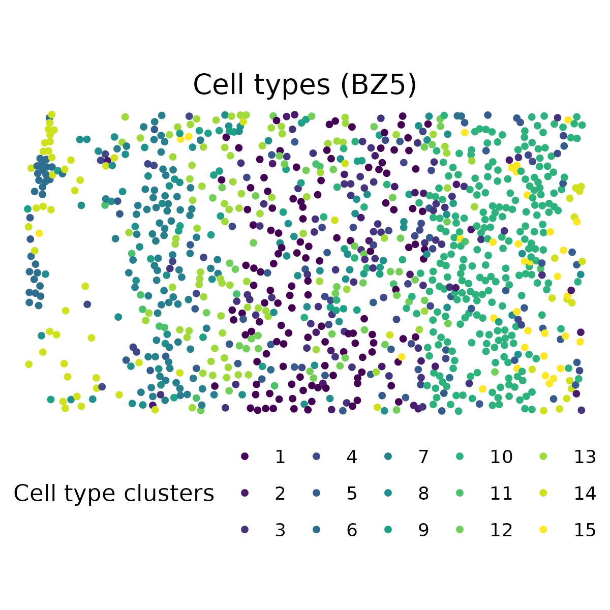
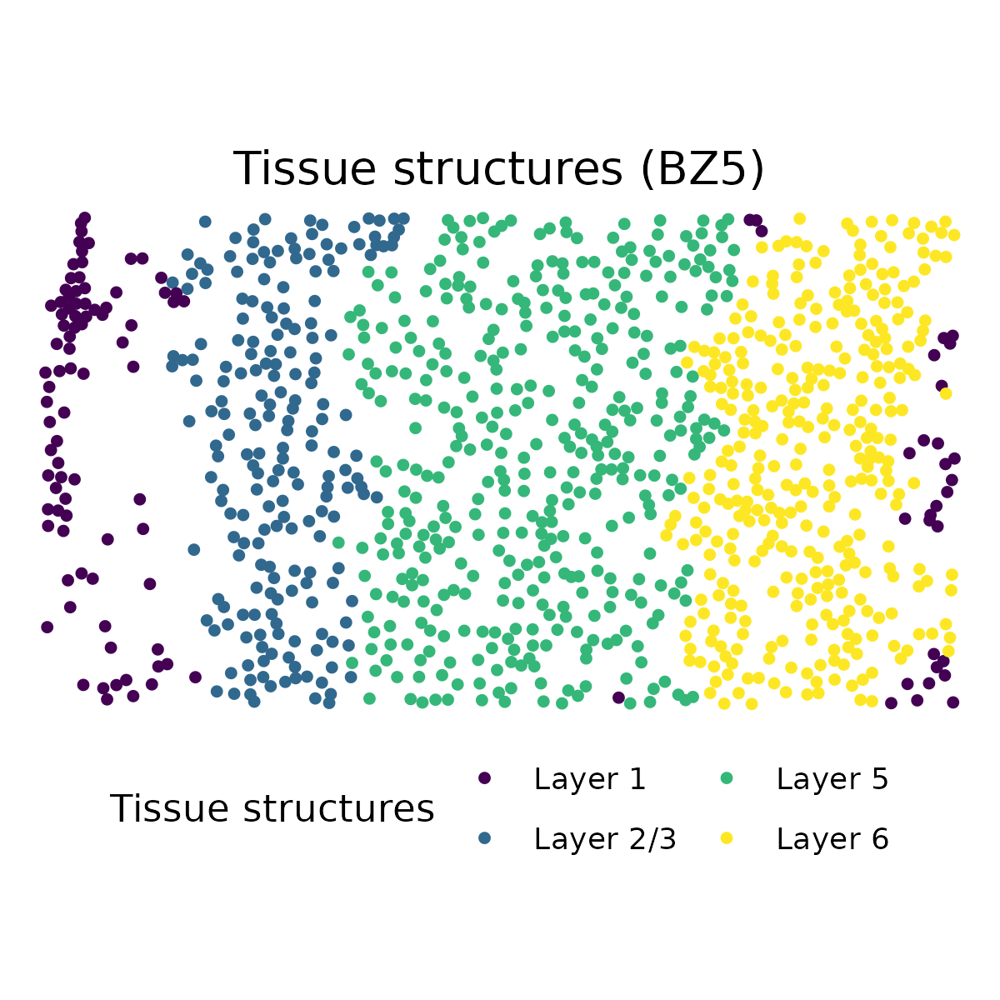
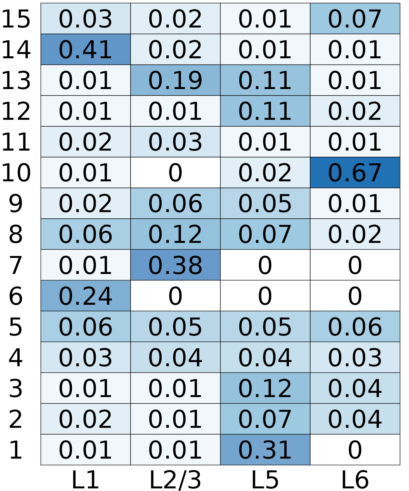
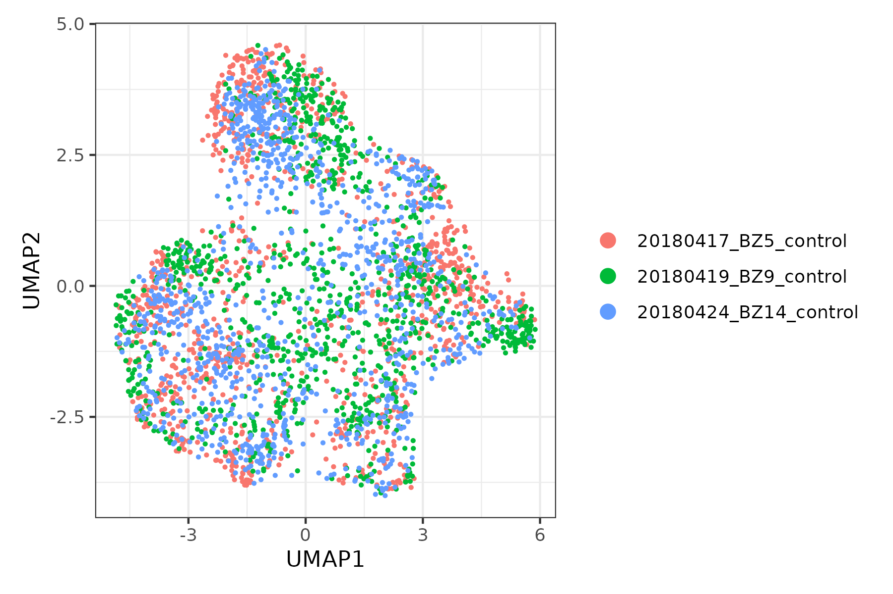
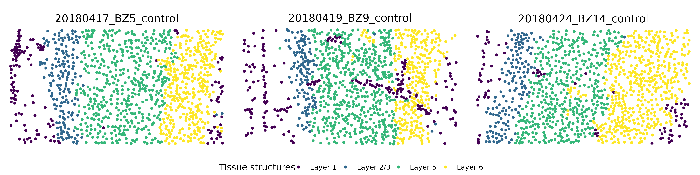
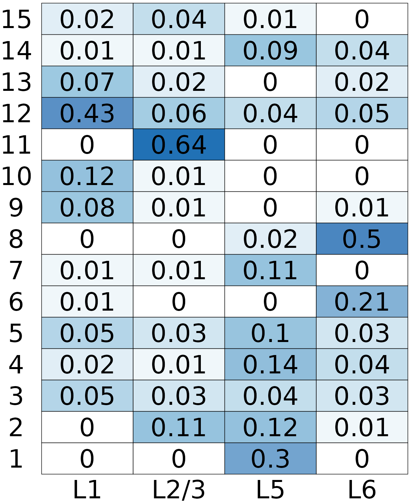

# BASS Tutorial
## Overview
We examplify the usage of BASS model with mPFC (mouse medial prefrontal cortex) data from [Wang et al 2018](https://www.science.org/doi/10.1126/science.aat5691). For single tissue section analysis, we focus on the tissue section BZ5. For multiple tissue section analysis, we obtain two additional tissue sections BZ9 and BZ14 that measured the same mPFC region in different animals. We excluded cells that are annotated to be "NA" class by the [original study](https://www.science.org/doi/10.1126/science.aat5691) as they were not confidently identified to be any cell type. Finally, we obtained the same set of 166 genes measured on 1,049 (BZ5), 1,053 (BZ9), and 1,088 (BZ14) cells along with their centroid coordinates for the following analysis. The processed data can be downloaded from [here](https://github.com/zhengli09/BASS-Analysis/blob/main/README.md).

## Install and load BASS package
```r
if(!require(devtools))
  install.packages(devtools)
devtools::install_github("zhengli09/BASS")
library(BASS)
```

## Load STARmap data
```r
load("starmap_mpfc.Rdata")
```

## Multi-scale transcriptomic analysis
### Single tissue section analysis
```r
# We focus on the tissue section BZ5 for single tissue section analysis
cnts <- starmap_cnts[["20180417_BZ5_control"]]
info <- starmap_info[["20180417_BZ5_control"]]
xy <- as.matrix(info[, c("x", "y")])
```
We set the number of cell types `C` to be 15 and the number of tissue structures `R` to be 4 in this data following [Wang et al 2018](https://www.science.org/doi/10.1126/science.aat5691). We also set a `seed` to ensure reproducibility.
```r
C <- 15
R <- 4
set.seed(0)
```
The `createBASSObject()` function creates a BASS object to handle all the data and parameters necessary for running the BASS model. We estimate the spatial smoothing parameter &beta; from the data by setting `beta_est_approach = "ACCUR_EST"`. The smoothing parameter &beta; can also be fixed beforehand by setting `beta_est_approach = "FIXED"` and `beta = betavalue`.  We suggest running the MCMC algorithm with 10,000  burn-in steps (`burn_in = 10000`) and 10,000 posterior samples (`samples = 10000`).
```r
BASS <- createBASSObject(list(cnts), list(xy), C = C, R = R, beta_est_approach = "ACCUR_EST", 
burn_in = 10000, samples = 10000)
# ***************************************
#  Bayesian Analytics for Spatial Segmentation (BASS)
#  Authors: Zheng Li, Xiang Zhou
#  Affiliate: Department of Biostatistics, University of Michigan
#  INPUT INFO:
#    - Number of samples: 1 
#    - Number of spots/cells: 1049 
#    - Number of genes: 166 
#    - Potts interaction parameter estimation approach: ACCUR_EST 
#  To list all hyper-parameters, Type listAllHyper(BASS_object)
# ***************************************
```
BASS provides a helper function `BASS.preprocess` for a standard expression data pre-processing. Users can also pre-process the data before creating the BASS object and set all the pre-processing procedures to be `FALSE` in `BASS.preprocess`. A standard expression data pre-processing includes library size normalization and log-transformation (`doLogNormalize`), selection of `nHVG` top highly variable genes (`doSelectHVGs`), and extraction of `nPC` top principal components (`doPCA`). In this data, we included all the genes before running PCA because all genes measured in this data are either putative cell-type markers or activity-regulated genes that are informative for distinguish different cell types.
```r
BASS <- BASS.preprocess(BASS, 
    doLogNormalize = TRUE,
    doSelectHVGs = FALSE,
    doPCA = TRUE,
    nPC = 20)
```
We run the BASS algorithm with `BASS.run()` function. All the posterior samples can be retreived from `BASS@res`.
```r
BASS <- BASS.run(BASS)
# Estimating beta...
# Parameter beta has converged: fix beta to be 1.3906
# Warming up iteration: 10000/10000
# Sampling iteration: 10000/10000
# done
```
BASS provides a function to post-process the posterior samples. Under the hood, the interative version 1 of ECR algorithm is used to deal with the label switching problem. Through our algorithm, we estimate the key parameters of interest that include the cell type labels, the cell type composition in each region, and tissue structure labels. These key parameter estimates can be retrieved from `BASS@res_postprocess`.

```r
BASS <- BASS.postprocess(BASS)
```

### Visualization
```r
library(ggplot2)
library(dplyr)
```
#### 1. Cell type clusters:
```r
c_est <- BASS@res_postprocess$c_ls[[1]]
plotClusters(xy, labels = c_est, title = "Cell types (BZ5)") +
  theme(legend.position = "bottom") +
  scale_color_viridis_d(name = "Cell type clusters")
ggsave("STARmap_cell_types.png", bg = "white", height = 4, width = 4)
```
<p align="center">

</p>

#### 2. Tissue structures:
```r
z_est <- BASS@res_postprocess$z_ls[[1]]
z_est <- dplyr::recode(z_est, `1` = "Layer 5",`2` = "Layer 1",
  `3` = "Layer 6", `4` = "Layer 2/3")
plotClusters(xy, labels = z_est, title = "Tissue structures (BZ5)") +
  theme(legend.position = "bottom") +
  guides(color = guide_legend(nrow = 2)) +
  scale_color_viridis_d(name = "Tissue structures")
ggsave("STARmap_tissue_structures.png", bg = "white", height = 4, width = 4)
```
<p align="center">

</p>

#### 3. Cell type compositions in each tissue structure:
```r
pi_est <- BASS@res_postprocess$pi_ls
# adjust column orders to match the order of layers
pi_est <- pi_est[, c(2, 4, 1, 3)]
colnames(pi_est) <- c("L1", "L2/3", "L5", "L6")
rownames(pi_est) <- 1:15
plotCellTypeComp(pi_est)
ggsave("STARmap_cell_type_composition.png", dpi = 500, bg = "white", 
    height = 3, width = 2.5)
```
<p align="center">

</p>

## Integrative analysis of three tissue sections
```r
cnts <- starmap_cnts
xy <- lapply(starmap_info, function(df) as.matrix(df[, c("x", "y")]))
```
### Batch effect adjustment
We suggest checking for potential batch effect across tissue sections by plotting low-dimensional representation of the data and make batch effect correction, if necessary, before running the BASS algorithm. Standard packages such as [Seurat](https://satijalab.org/seurat/articles/integration_introduction.html) and [Harmony](https://portals.broadinstitute.org/harmony/index.html) can be used to correct the batch effects. In this dataset, we did not observe noticeable batch effect.
```r
# Use Seurat package to generate the UMAP plot
# install.packages('Seurat')
library(Seurat)
seu <- CreateSeuratObject(counts = do.call(cbind, cnts), min.cells = 1)
seu <- NormalizeData(seu)
seu <- ScaleData(seu)
seu <- RunPCA(seu, features = rownames(seu))
seu <- RunUMAP(seu, dims = 1:20)
Idents(seu) <- rep(names(cnts), times = sapply(cnts, ncol))
DimPlot(seu, reduction = "umap") +
  theme_classic() +
  xlab("UMAP1") +
  ylab("UMAP2") +
  theme(legend.position = "right") +
  theme_bw()
ggsave("STARmap_umap.png", bg = "white", height = 4, width = 6)
```
<p align="center">

</p>

The spatial smoothing parameter &beta; is estimated using the first tissue section to reduce computational burden when we perform the integrative analysis.
```r
# Set hyper-parameters
C <- 15
R <- 4
set.seed(0)
BASS <- createBASSObject(cnts, xy, C = C, R = R, beta_est_approach = "ACCUR_EST", 
burn_in = 10000, samples = 10000)
# ***************************************
#  Bayesian Analytics for Spatial Segmentation (BASS)
#  Authors: Zheng Li, Xiang Zhou
#  Affiliate: Department of Biostatistics, University of Michigan
#  INPUT INFO:
#    - Number of samples: 3 
#    - Number of spots/cells: 1049 1053 1088 
#    - Number of genes: 166 
#    - Potts interaction parameter estimation approach: ACCUR_EST 
#  To list all hyper-parameters, Type listAllHyper(BASS_object)
# ***************************************
```
```r
BASS <- BASS.preprocess(BASS, doSelectHVGs = FALSE)
BASS <- BASS.run(BASS)
# Estimating beta in the first tissue section
# Estimating beta...
# Parameter beta has converged: fix beta to be 1.36378
# Warming up iteration: 10000/10000
# Sampling iteration: 10000/10000
# done
BASS <- BASS.postprocess(BASS)
```
### Visualization
```r
library(ggplot2)
library(dplyr)
library(cowplot)
```
#### 1. Cell type clusters:
```r
p_c <- lapply(1:BASS@L, function(l){
    c_est_l <- BASS@res_postprocess$c_ls[[l]]
    plotClusters(xy[[l]], labels = c_est_l, title = names(cnts)[[l]]) +
      scale_color_viridis_d(name = "Cell type clusters") +
      theme(plot.margin = margin(6, 0, 6, 0))
  })
legend <- get_legend(
    p_c[[1]] + 
      theme(legend.position = "bottom") +
      guides(color = guide_legend(nrow = 2))
  )
p_c <- plot_grid(plotlist = p_c, nrow = 1)
plot_grid(p_c, legend, ncol = 1, rel_heights = c(1, 0.1))
ggsave("STARmap_mult_cell_types.png", bg = "white", height = 4, width = 12)
```
<p align="center">

</p>

#### 2. Tissue structures:
```r
p_z <- lapply(1:BASS@L, function(l){
    z_est_l <- BASS@res_postprocess$z_ls[[l]]
    z_est_l <- dplyr::recode(z_est_l, `1` = "Layer 5",`2` = "Layer 1",
      `3` = "Layer 6", `4` = "Layer 2/3")
    plotClusters(xy[[l]], labels = z_est_l, title = names(cnts)[[l]]) +
      scale_color_viridis_d(name = "Tissue structures") +
      theme(plot.margin = margin(6, 0, 6, 0))
  })
legend <- get_legend(
    p_z[[1]] + 
      theme(legend.position = "bottom") +
      guides(color = guide_legend(nrow = 1))
  )
p_z <- plot_grid(plotlist = p_z, nrow = 1)
plot_grid(p_z, legend, ncol = 1, rel_heights = c(1, 0.1))
ggsave("STARmap_mult_tissue_structures.png", bg = "white", height = 3, width = 12)
```
<p align="center">

</p>

#### 3. Cell type compositions in each tissue structure:
```r
pi_est <- BASS@res_postprocess$pi_ls
pi_est <- pi_est[, c(2, 4, 1, 3)]
colnames(pi_est) <- c("L1", "L2/3", "L5", "L6")
rownames(pi_est) <- 1:15
plotCellTypeComp(pi_est)
ggsave("STARmap_mult_compositions.png", dpi = 500, bg = "white", height = 3, width = 2.5)
```
<p align="center">

</p>
